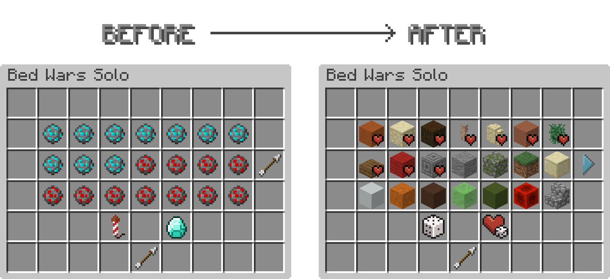

# Hypixel UI Enhancer



### About
This project is a fan-made Minecraft resource pack and is intended to comply with Minecraft’s Terms of Use. All Minecraft assets remain the property of Mojang Studios and Microsoft.
The pack is designed for Minecraft Java Edition and is commonly used for PvP and Hypixel gameplay.
It includes modified default Minecraft textures as well as custom-made assets.

## Installation:
1. Download the resource pack `.zip` file (from Releases)
2. Open Minecraft Java Edition
3. Go to `Options → Resource Packs`
4. Click `Open Pack Folder`
5. Move the `.zip` file into the folder
6. Enable the resource pack in-game and move it to the top of the list
## Compatibility/Requirements
- Minecraft Version: 1.8.9
- requires Optifine (Included in all major clients)

## Edit your own Pack
To customize the texture pack to your liking, you can use my Python script. It makes working with CIT easier, especially when dealing with the maps. (You should have some prior experience with Minecraft texture packs, otherwise it will be difficult to understand)
### Setup
First you need to clone the repository:
```bash
git clone https://github.com/EnderLumi/Hypixel-UI-Enhancer.git
```
Use a virtual environment to run this project
```bash
cd /Path/to/Hypixel-UI-Enhancer
```
Create a Virtual environment and install the requirements
```bash
python -m venv .venv
source .venv/bin/activate
python -m pip install --upgrade pip
python -m pip install Pillow PySide6
```
To Run the script, type:
```bash
source /Path/to/Hypixel-UI-Enhancer/.venv/bin/activate
python app.py
```

> **Note**
> On Linux and macOS, you may need to use `python3` instead of `python`.

### Add to Minecraft
To use it in Minecraft, you can now take the `cit` folder inside the repository and copy it in the texture pack under `Hypixel-UI-Enhancer/assets/minecraft/mcpatcher/cit`.

Now all you have to do is place the texture pack in the Minecraft resourcepacks folder.

## Disclaimer
This project is not affiliated with, endorsed by, or sponsored by Mojang Studios, Microsoft, or Hypixel.
Minecraft is a trademark of Mojang Studios and Microsoft. Hypixel is a trademark of Hypixel Inc. This resource pack is not officially associated with any of these companies.

## Usage Terms
You are allowed to:
- Use this resource pack in-game
- Modify it for personal use

You are NOT allowed to:
- Reupload or redistribute this pack as your own
- Sell this pack or any modified version
- Claim original creation of included assets
